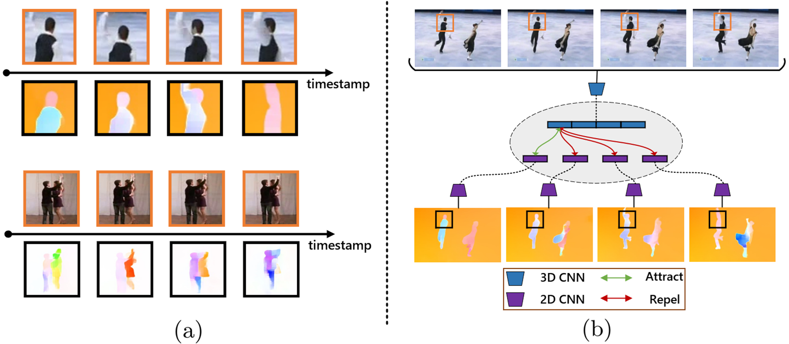

# MSCL
Official code for **M**otion **S**ensitive **C**ontrastive **L**earning for Self-supervised Video Representation (ECCV2022).

## Introduction

Contrastive learning has shown great potential in video representation learning. However, existing approaches fail to fully exploit short-term motion dynamics, which are crucial to various down-stream video understanding tasks. In this paper, we propose Motion Sensitive Contrastive Learning (MSCL) that injects the motion information captured by optical flows into RGB frames to strengthen feature learning. To achieve this, in addition to clip-level global contrastive learning, we develop Local Motion Contrastive Learning (LMCL) with frame-level contrastive objectives across the two modalities. Moreover, we introduce Flow Rotation Augmentation (FRA) to generate extra motion-shuffled negative samples and Motion Differential Sampling (MDS) to accurately screen training samples. Extensive experiments on standard benchmarks validate the effectiveness of the proposed method. With the commonly-used 3D ResNet-18 as the backbone, we achieve the top-1 accuracies of 91.5\% on UCF101 and 50.3\% on Something-Something v2 for video classification, and a 65.6\% Top-1 Recall on UCF101 for video retrieval, notably improving state-of-the-art methods.



## Getting Started
This repo is developed from [MMAction2](https://github.com/open-mmlab/mmaction2) codebase, please follow the install instruction of MMAction2 to setup the environment.

Please refer to the document of mmaction2 now.


## Training

```shell
bash ./tools/dist_train.sh configs/recognition/moco/mscl_r18_cosm_lr2e-2.py 4 --validate --seed 0 --deterministic
```

## Downstream Classification Fine-tuning

```shell
bash ./tools/dist_train.sh configs/recognition/ssl_test/test_ssv2_r18.py 1 --validate --seed 0 --deterministic
```

## Downstream Retrieval

Only one gpu is supported for retrieval task.
```shell
bash ./tools/test_retrival.sh configs/recognition/ssl_test/test_ssv2_r18.py {your checkpoint path}
```

## TODO

- 🔲 Add scripts for flow extraction and sample generation
- 🔲 Transfer data pipeline from OSS server to basic file system


## Acknowledgement

This repo is based on [mmaction2](https://github.com/open-mmlab/mmaction2).
